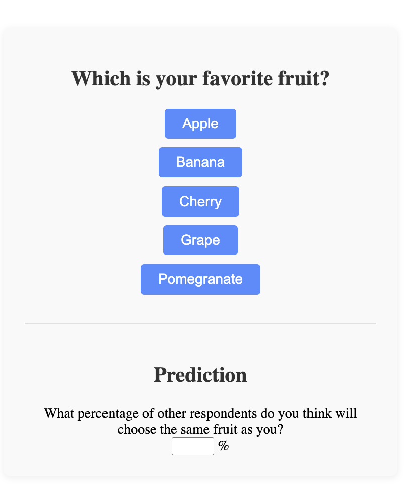

# Introduction to CSS

---
## What is CSS?
- Cascading Style Sheets
- Controls the look and feel of web pages

### Resources for Further Exploration
- [MDN CSS Guide](https://developer.mozilla.org/en-US/docs/Web/CSS)

---
## Example: Poll Page Styling




---
**Activity:**
  - Open the file `poll.css` in your code editor.
  - Review the CSS selectors and properties in the file.

  **To see the effect in a browser:**
  1. Open `poll_static_with_css.html` in your code editor.
  2. Preview the file in your browser (see HTML instructions for a reminder on how to open a file in the browser).
  3. Notice how the appearance changes with CSS applied.

---
## Key Features in the Example

---
## External Stylesheet Structure
- CSS is kept in a separate `.css` file and linked in the HTML `<head>`.
- This keeps style and content separate for maintainability.
- The `<link>` tag in the HTML `<head>` includes the CSS file.
- There are two other common ways to include CSS: inline styles and `<style>` tags in the HTML `<head>`.
    - these are less maintainable
    - we follow best practice in this course and won't use them

```html
<head>
  <title>Poll Example</title>
  <link rel="stylesheet" href="poll.css">
</head>
```

---
## Selectors and Properties
- Selectors target HTML elements by class, tag, or relationship.
    - with `.poll-container`, any element with class "poll-container" will have this style applied
- Properties define the visual style.
    - background is a color
    - padding adds space inside the border 

```css
.poll-container {
  background: #f9f9f9;
  border-radius: 8px;
  padding: 24px;
}
```

---
## Limiting Scope of Styles
- `.poll-container ul` styles only `<ul>` elements that are inside `.poll-container`.
- `list-style: none` removes the default bullet points from the list.
- When asking copilot to style for you, you maay want to ask or request about which classes certain style should apply to.
    - Watch out for styles that overwrite other styles unintentionally!
    - Ask copilot for help in understanding which styles apply where.


```css
.poll-container ul {
  list-style: none;
  padding: 0;
}
```

--- 
## Styling Buttons
- `cursor` changes the cursor appearance when hovering on button
- `transition` makes the background color change smoothly on hover.
-- `.poll-container button:hover` applies style when the mouse is over the item.
```css

.poll-container button {
  padding: 8px 20px;
  font-size: 16px;
  border: none;
  border-radius: 4px;
  background: #4f8cff;
  color: #fff;
  cursor: pointer;
  transition: background 0.2s;
}
.poll-container button:hover {
  background: #357ae8;
}
```

---
## 5. Section Separators and Layout
- This style applies only to `<section>` elements that are immediately preceded by another `<section>`, with both inside `.poll-container`.
  - In our case, it adds the dividing line between sections.
  - If we had three sections, there would be a second dividing line automatically.

```css
.poll-container section + section {
  border-top: 2px solid #e0e0e0;
  margin-top: 32px;
  padding-top: 24px;
}
```

---
## 6. Experiment!
- Try changing colors, spacing, or borders in `poll.css`.
- Don't forget to save the file each time and then reload the browser tab to see changes.
