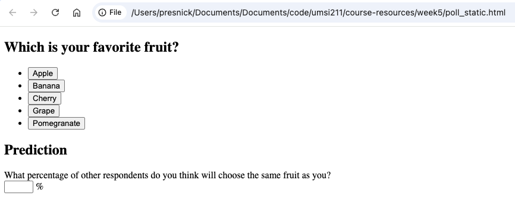

# Introduction to HTML

---
## What is HTML?
- HyperText Markup Language
- Structure of web pages
- Uses tags to organize and display content

### Resources for Further Exploration
- [MDN HTML Guide](https://developer.mozilla.org/en-US/docs/Web/HTML)

---
## Example: a Poll Page



---
**Activity:**
  - Open the file `poll_static.html` in your code editor.
  - Review the HTML structure and tags in the file.

  **To view the page in a browser (from a GitHub Codespace):**
  1. Right-click on `poll_static.html` in the file explorer and select "Preview" or "Open with Live Server" (if available).
  2. Alternatively, use the Codespace browser preview feature:
     - Click the "Ports" tab in Codespaces.
     - If using Live Server, find the port and click "Open in Browser".
     - If not using Live Server, you can use the built-in file preview.
  3. The page will open in a browser tab, showing your poll as rendered HTML.


---
## Key Features in the Example

---
## 1. Structure
- Every tag like `<html>` has content inside, and then a closing tag `</html>`.
- For an HTML document, the enclosing `<html>` tag includes two top-level tags: `<head>` and `<body>`.
- Indentation can be helpful for human readers, but is not required.

```html
<!DOCTYPE html>
<html>
  <head>
    <title>Poll Example</title>
  </head>
  <body>
    ...
  </body>
</html>
```

---

## 2. `<section>` as semantic divider

Using `<section>` tags to divide the page into meaningful parts is a good practice.
- It's especially helpful for accessibility (screen readers, etc.)

```html
<div class="poll-container">
    <section>...</section>
    <section>...</section>
  ...
</div>
```
---
## 3. Headings and Lists
- `<h1>`, `<h2>`, etc. for headings
- `<ul>` for unordered lists
    - `<li>` for list items
- `<button>` for clickable buttons
    - Later we'll add interactivity with JavaScript to make the button do something
```html
<section>
  <h2>Which is your favorite fruit?</h2>
  <ul>
    <li><button>Apple</button></li>
    <li><button>Banana</button></li>
    <li><button>Cherry</button></li>
    <li><button>Grape</button></li>
    <li><button>Pomegranate</button></li>
  </ul>
</section>
```
---
## 4. `<form>` for user input

```html
<section>
  <h2>Prediction</h2>
  <form>
    <label for="prediction">What percentage of other respondents do you think will choose the same fruit as you?</label><br>
    <input type="number" id="prediction" name="prediction" min="0" max="100" step="1"> %
  </form>
</section>
```

