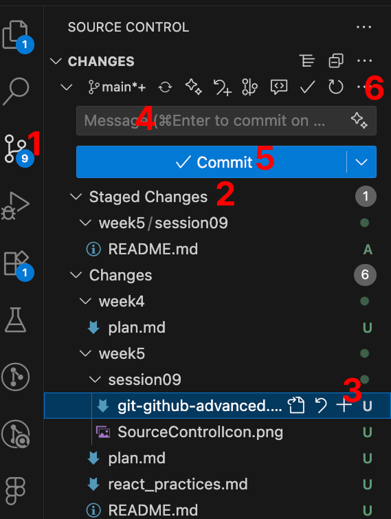
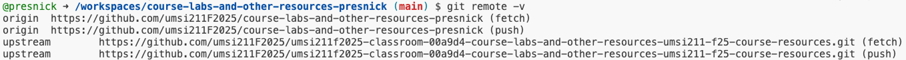
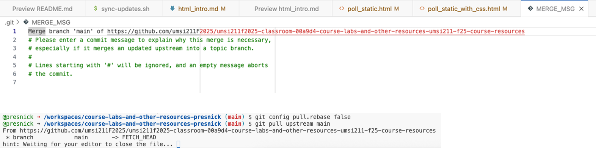

# Git & GitHub: Part 2

---

## Quick Review: Git Basics (from week 1)
- `git status`
- `git add`
    - `git add <filename>` adds a specific file
    - `git add .` adds all changed files
- `git commit`
    - `git commit -m "your message"` commits changes with a message
- `git push`
    - `git push origin main` pushes changes to the main branch on the origin remote
---

## Git Basics from the VS Code GUI

|  |  |
|:--:|--|
|  | 1. The icon to open the Source Control panel 2. Files in the Staged Changes area have been "added" 3. Unstage files by clicking the - icon 4. Write a commit message in this box 5. Click the checkmark to commit 6. Click here for full menu, including Push |

---

## Git Branches

- A branch is a separate line of development with a history of commits
- The default branch is usually called `main` (or sometimes `master`)
- You can create new branches to work on features or fixes without affecting the main codebase
- Common commands:
  - `git branch <branch-name>`: Create a new branch
  - `git checkout <branch-name>`: Switch to a different branch
  - `git checkout -b <branch-name>`: Create and switch to a new branch

---

## Merging Branches
- `git merge <branch-name>`: Merge changes from another branch into the current branch

- Only works if::
    - no uncommitted changes in the working directory
    - some common ancestry, a point in the past where the two branches were the same

---

## Working with Multiple Remotes

- A remote is a version of your repository hosted somewhere else (e.g., GitHub)
- You can have multiple remotes for a single local repository
  - in this case, `origin` is my personal GitHub repo and `upstream` is the class GitHub repo
 
---

## Pulling from Different Remotes

- `git pull <remote> <branch>` fetches and merges changes from the specified remote
    - e.g., `git pull upstream main`
        - fetches the `main` branch of the `upstream` remote, creating a local copy of it as a branch called `upstream/main`
        - then merges that branch into your current working directory
- This is a less mysterious way to get update from the class repo than our `./sync-upstream.sh` script

---
## Example: Pulling from Upstream Remote

---
## Important Notes on Pulling from Upstream Remote
- Run `git config pull.rebase false` 
    - sets the default pull behavior to "merge" changes with any changes you have.
    - Only have to do it once.
    - After that, it should remember. Might have to repeat if your codespace resets.
- It opens a file in VS Code to edit the commit message for the merge. 
    - You have to close that file to complete the merge.
    - Where it says in the terminal "hint: Waiting for your editor to close the file...", it's reminding you about that.

---
## What Can Go Wrong with Git Pull?

- **Uncommitted changes** If you have uncommitted changes to a file that would be overwritten, `git pull` may fail with an error message.
    - I recommend committing your changes before pulling.
    - There is another option called stashing that can help with this, but it's another thing to learn and I don't recommend it for beginners.
- **Merge conflicts** If you have committed changes to a file that was also changed in the upstream repo, git will try to merge the changes within the file, but if there are conflicting changes, you will get a merge conflict.

---

## Resolving Merge Conflicts

This YouTube video explains it really well: https://www.youtube.com/watch?v=DloR0BOGNU0

Be sure you watch it and understand it. You can always ask your copilot to help you understand any vocabulary that's tripping you up.
