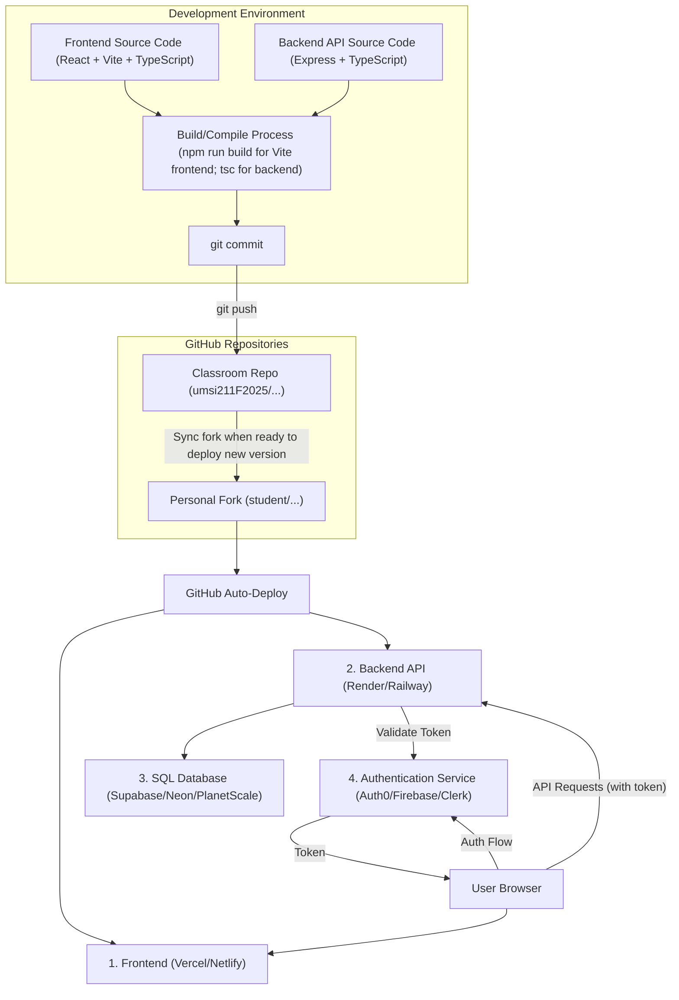

# Conceptual Architecture: Full-Stack React App

Below is a conceptual diagram of a deployed full-stack React app with a backend API, SQL database, and third-party authentication service:

```mermaid
flowchart TD
    subgraph F["Development Environment"]
        F1["Frontend Source Code (React + Vite + TypeScript)"]
        F2["Backend API Source Code (Express + TypeScript)"]
        F3["Build/Compile Process (npm run build for Vite frontend; tsc for backend)"]
        F1 --> F3
        F2 --> F3
        F4["git commit"]
        F3 --> F4
    end

    subgraph GH["GitHub Repositories"]
        GH1["Classroom Repo (umsi211F2025/...)"]
        GH2["Personal Fork (student/...)"]
        GH1 --> |"Sync fork when ready to deploy new version"| GH2
    end

    F4 --> |"git push"| GH1
    GH2 --> AD["GitHub Auto-Deploy"]

    AD --> B["1. Frontend (Vercel/Netlify)"]
    AD --> C["2. Backend API (Render/Railway)"]
    A["User Browser"] --> B
    A -- "API Requests (with token)" --> C
    C --> D["3. SQL Database (Supabase/Neon/PlanetScale)"]
    C -- "Validate Token" --> E["4. Authentication Service (Auth0/Firebase/Clerk)"]
    A -- "Auth Flow" --> E
    E -- "Token" --> A
```
